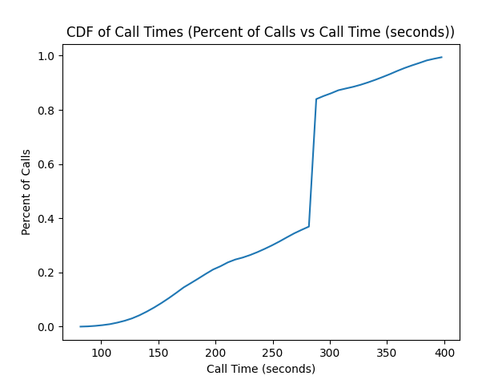
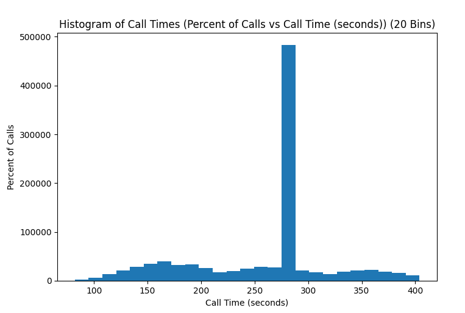

# Analyzing Customer Wait Times for A Ticketing Service

## Authors: Marcus Muntean, Ryland Birchmeier || Date: 10/23/2023

### The given scenario is about waiting times for customers calling a ticketing agency. This paper will analyze various statistics about W, a random variable which represents the wait times. W is based on a person's journey through the ticketing process. It takes into account dialing times, hang up times, waiting to be connected with a switchboard, and talking with an agent. Customers can also decide to hang up and call again later for a maximum of 3 total calls. We have developed computer code to help answer some questions that the ticketing agency may have about their customer's wait times.

## Extremes

### Let's look at the two extremes first. The least amount of time possible for a customer to wait during the process is 82 seconds, and the most is 404 seconds. Therefore, the range of possible values for W is 
$$
82 \leq W \leq 404
$$

### MIN: The min scenario will occur when the customer rings and gets through to the switchboard immediately, and then talks with the fastest agent:

```
3 seconds to call + 
0 seconds waiting for the switchboard + 
5 seconds waiting to connect to an agent + 
72 seconds to get the ticket with the fastest agent + 
2 seconds to hang up 

= 82 seconds total.
```

### MAX: The max scenario will occur will the customer fails to get a ticket the first two times, then gets a ticket on the third try. This is represented like so:

```
(   3 seconds to call + 
    90 seconds waiting for the switchboard + 
    2 seconds hanging up
) * 2 + 
(   3 seconds to call + 
    90 seconds waiting for the switchboard + 
    5 seconds waiting to connect to an agent + 
    114 seconds to get the ticket with the slowest agent + 
    2 seconds to hang up
) 

= 404 seconds total
```

## Expected Wait Time (E(w))

### Another question the ticketing agency may have is about the average wait time for a customer. Using our computer algorithm, we have found that the expected wait time to be ~260.3314 seconds. In other words, we calculated:

```
E[W] ~= 260.3314
```

## Median Wait Time

### The median wait time is the middle value of the wait times. In other words, half of the wait times are less than the median, and half are greater. We have found the median wait time to be EXACTLY equal to:

```
Median ~= 285 seconds
```

### This median wait time also happens to correspond to the case that the caller quits before getting through to a representative three times.

## Probability of Obtaining Tickets

### The ticketing agency may also be interested in the probability of a customer getting a ticket. We have found that the probability of a customer getting a ticket is:

```
P[Obtain Ticket] = ~0.543026
```


## CDF (Fw(w)) of Wait Times
### The CDF of wait times is the probability that a customer will wait less than or equal to a certain amount of time. We have found the CDF of wait times to be:

```
      --- CDF Table ---
| x =  82.000 , Fx(x) = 0.000 |
| x =  88.440 , Fx(x) = 0.001 |
| x =  94.880 , Fx(x) = 0.003 |
| x = 101.320 , Fx(x) = 0.006 |
| x = 107.760 , Fx(x) = 0.009 |
| x = 114.200 , Fx(x) = 0.015 |
| x = 120.640 , Fx(x) = 0.022 |
| x = 127.080 , Fx(x) = 0.030 |
| x = 133.520 , Fx(x) = 0.042 |
| x = 139.960 , Fx(x) = 0.056 |
| x = 146.400 , Fx(x) = 0.071 |
| x = 152.840 , Fx(x) = 0.088 |
| x = 159.280 , Fx(x) = 0.106 |
| x = 165.720 , Fx(x) = 0.125 |
| x = 172.160 , Fx(x) = 0.145 |
| x = 178.600 , Fx(x) = 0.161 |
| x = 185.040 , Fx(x) = 0.178 |
| x = 191.480 , Fx(x) = 0.195 |
| x = 197.920 , Fx(x) = 0.211 |
| x = 204.360 , Fx(x) = 0.223 |
| x = 210.800 , Fx(x) = 0.238 |
| x = 217.240 , Fx(x) = 0.248 |
| x = 223.680 , Fx(x) = 0.255 |
| x = 230.120 , Fx(x) = 0.265 |
| x = 236.560 , Fx(x) = 0.275 |
| x = 243.000 , Fx(x) = 0.287 |
| x = 249.440 , Fx(x) = 0.301 |
| x = 255.880 , Fx(x) = 0.315 |
| x = 262.320 , Fx(x) = 0.330 |
| x = 268.760 , Fx(x) = 0.345 |
| x = 275.200 , Fx(x) = 0.358 |
| x = 281.640 , Fx(x) = 0.370 |
| x = 288.080 , Fx(x) = 0.840 |
| x = 294.520 , Fx(x) = 0.852 |
| x = 300.960 , Fx(x) = 0.861 |
| x = 307.400 , Fx(x) = 0.872 |
| x = 313.840 , Fx(x) = 0.879 |
| x = 320.280 , Fx(x) = 0.885 |
| x = 326.720 , Fx(x) = 0.892 |
| x = 333.160 , Fx(x) = 0.901 |
| x = 339.600 , Fx(x) = 0.910 |
| x = 346.040 , Fx(x) = 0.921 |
| x = 352.480 , Fx(x) = 0.932 |
| x = 358.920 , Fx(x) = 0.944 |
| x = 365.360 , Fx(x) = 0.954 |
| x = 371.800 , Fx(x) = 0.964 |
| x = 378.240 , Fx(x) = 0.973 |
| x = 384.680 , Fx(x) = 0.983 |
| x = 391.120 , Fx(x) = 0.989 |
| x = 397.560 , Fx(x) = 0.994 |
| x = 404.000 , Fx(x) = 1.000 |
```
### If you plot the points and connect them with a line, you would obtain a graph of the CDF that looks as follows:

### Note the spike at 285 corresponding to the case that the caller quits before getting through to a representative three times.

## PDF (fw(w)) of Wait Times
### The PDF of wait times representents the weight of choosing each wait time when sampled from a distribution. We have found the approximate PDF of wait times to be:


### There is one (very) notable spike in our graph of the PDF. This spike, as mentioned previously, is caused by the case that customers are not able to reach the call center because they hang up on their third attempt at getting through and quit. This case also happened to correspond to the median wait time, and, looking at the graph, this seems to make visual sense. The value of the spike can be calculated by hand to be:

$$
(3 + 90 + 2) \cdot 3 = 285\space seconds
$$


### On our honor, we have not gotten any outside help on this project, except from the instructor or TA or your partner. Signed:

### Marcus Muntean, Ryland Birchmeier
